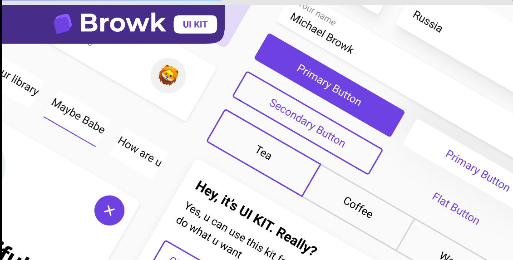

  

  <h1>Browk UI Kit</h1>
  
A React component library based on the <a href="https://www.figma.com/community/file/817436609226882468">Browk UI Kit</a>.

🚧 **_under construction_** 🚧

---

Made with ❤️ by [evfjunior](https://github.com/evfjunior)

